[TOC]

# 第一章 基本原理

从数据分析的角度来考虑，我们需要研究：

1. 序列是否在固定水平上下变动？
2. 此水平是否也在变动？
3. 是否有某种上升或下降的趋势呢？
4. 是否存在有季节性的模式？
5. 是否季节性的模式也在变更呢？
6. 是否存在周期性规律和模式？

时间序列有一明显的特性就是记忆性(memory)，记忆性系指时间数列中的任一观测值的表现皆受到过去观测值影响。

## （一）时间序列

时间序列也称动态序列，是指将某种现象的指标数值按照时间顺序排列而成的数值序列。大量的社会经济统计指标都是依据年、季度、月、日，甚至实时（秒）统计的，因此，时间序列是某个统计指标（变量）长期变动的数值表现。
- 时间序列的两个组成要素
	- 时间要素：某一现象发生的时间，包括时间单位和时间长短
	- 数值要素：现象在不同时间上的变量值

时间序列可以反映某个现象的发展变化状态。通过对时间序列的分析，可以反映现象发展变化的趋势和规律，再通过对影响时间序列的各种因素进行测定，可以进一步解释现象变化的内在原因，为预测和决策提供可靠的数据支持。

### 1 时间序列的类别
- 1 按研究对象的数量分类
  - 可以分为一元时间数列和多元时间数列。
  - 上表就是一元时间数列。但是，如果按年、月的顺序排列气温和降水量等，每一时间上都对应两个变量，则为多元时间数列。
  - 多元时间数列，不仅可以描述变量的变化规律，还可以揭示各变量间相互依存关系的动态规律性。

- 2 按时间的连续性分类
  - 可以分为离散型时间数列和连续性时间数列两种
  - 比如上面表格就是离散型时间数列；食品厂油炸机上的温度监控图就是连续性时间数列。
- 3、时间数列按照变量值的表现形式不同
  - 可以分为绝对数时间数列、相对数时间数列和平均数时间数列三种，绝对数时间数列是基本的。
    - 绝对数时间数列
      - 绝对数时间数列又可以分为时期数列和时点数列。
        - 时期数列中的每一个数值都表明现象在一段时间内所达到的总量，例如上表销售额就是时期数列；
        - 时点数列的每一个数值都放映某种现象在一定时点上所达到的水平或所处的状态，例如库存表就是实时的库存情况。
    - 相对数时间数列
      - 相对数时间数列是把同一性质的相对指标按照时间顺序排列，用以说明现象之间数量关系的变化过程。相对数是将有联系的变量处理后得到的数值，例如，实际值与计划值相比，用来表示计划完成的情况。
    - 平均数时间数列
      - 平均数时间数列是把一系列同一性质的平均指标数值按时间顺序排列而形成的时间数列，用以放映现象的一般水平在时间上的变化。例如做长期趋势分析用到的移动平均法。

### 2 时间数列制作原则
时间数列的目的，是为了通过对时间数列的对比分析，放映现象的发展变化过程及其发展变化的规律性。为此，必须保证时间数列中的各项指标数值具有可比性，主要包括以下几个方面：
- 时间上的可比性
  - 时期数列中各项指标数值与时期的长短直接相关，因而，在同一个数列中，各个指标数值所属的时间长短应尽量一致，但这个原则不是绝对的，有时为了特殊需要，也可以编制时期不同的时期数列。
  - 对于时间数列，则不一样，因为时点数列的各个指标与时期长短无关，可以根据需要而定。
- 总体范围的可比性
  - 这里的范围是指所研究现象的空间范围。例如，现象所包括的地区范围、隶属关系范围、分组范围等，这些范围在不同的历史时期会有变化，对指标产生影响，从而失去可比性。因而对总体范围有变化的资料，必须加以调整，以保障所编制的时间数列具有可比性。
- 指标内容的可比性
  - 只有同质的现象才能进行动态对比，时间数列中的每一个数值都具有一定的社会内容，而不是一个抽象数字。
- 各项指标数值的计算方法、计算单位以及计算价格等的可比性
  - 如反映劳动生产率变化时，指标值是工人生产率还是全员生产率；是以产值计算的，还是以实物量计算的前后应保持一致。
  - 排列价值指标时，是以现行价格，还是以不变价格计算，因为一般现行价格在不同时间不具有可比性，因而一般价值指标应按不变价格的形式进行排列。

## （二）时间序列分解
因为时间序列是某个指标数值长期变化的数值表现，所以时间序列数值变化背后必然蕴含着数值变换的规律性，这些规律性就是时间序列分析的切入点。一般情况下，时间序列的数值变化规律有以下四种：**长期变动趋势、季节变动规律、周期变动规律和不规则变动**。不同的数值变化规律是由不同影响因素决定的。这些影响因素有长期起作用的因素，也有短期因素；有可以预知和控制的因素，也有未知和不可控制的因素；这些因素相互作用和影响，从而使时间序列的变化趋势呈现不同的特点。根据影响因素对时间序列数值变化趋势的不同影响情况，可以分为四种影响因素：**长期趋势影响因素、季节变动影响因素、循环变动影响因素和不规则变动影响因素**。
四种变动就是时间序列数值变化的分解结果。有时这些变动会同时出现在一个时间序列里面，有时也可能只出现一种或几种，这是由引起各种变动的影响因素决定的。正是由于变动组合的不确定性，时间序列的数值变化才那么千变万化。
四种变动与指标数值最终变动的关系可能是叠加关系，也可能是乘积关系。

### 1 四种数值变化规律
#### 1）长期变动 T
长期趋势指的是统计指标在相当长的一段时间内，受到长期趋势影响因素的影响，表现出持续上升或持续下降的趋势，通常用字母T表示。例如，随着国家经济的发展，人均收入将逐渐提升；随着科学技术的发生，劳动生产率也不断提高。

##### 长期变动分析
研究长期趋势的目的主要是为了认识和掌握现象发展的规律性，为统计预测提供必要条件；同时，也是**为了将其从时间数列中剔除，以便分析其它因素对时间数列的影响**。
测定长期趋势的方法有很多，下面介绍两种常用的方法：移动平均法；最小二乘法（趋势方程法）；

###### A 移动平均法
移动平均法的实质是通过对变量值进行平均的方法，对原来的时间数列进行修匀，以消除季节变动、不规则变动等其他因素对数列产生的影响。
移动平均法又可以分为简单移动平均、加权移动平均和指数平滑三种形式。
- 1 简单移动平均
  - 基本过程如下：
    首先，确定移动的项数k，即每次平均时所包含的变量值的个数；
    其次，从时间数列的第一个变量值开始，每次向后移动一项，分别计算出k个数值的序时平均数；
    最后，将计算出来的每个移动平均数的数值与它所对应的时间对应排列，编制成一个新的时间数列。
  - 举例说明：某玩具公司近10年的销售数据及其移动平均表格
    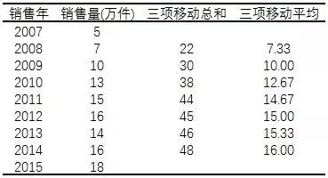
    从上表可以看出，对原时间数列来说，总的趋势是逐年增加，但对于个别年份来说，有下降的情况，这是由于一些不可知的偶然因素影响造成的，为消除这种偶然因素的影响，可以进行移动平均。进行移动平均后得到新的时间数列没有上下起伏波动，可以明显放映销售量变化的总趋势。
  - 应用移动平均法的几个注意点：
    1、应合理选择移动项数。移动项数越多，修匀效果越好，但新时间数列项数越少，不利于进行长期趋势分析；反之，移动项数越少新数列项数多，修匀效果不好。所以应根据所研究对象的具体特点，来确定移动的项数。**如果原数列指标数值有周期性变化，应以周期的长度作为移动的项数。**例如，季度资料作四项移动平均，月资料作十二项移动平均，这样可以消除周期性的季节影响。
    2、利用平均法进行长期趋势分析时要有足够的资料，否则不能如实放映现象固有的变化趋势，这也是进行长期趋势分析的前提条件。
    3、移动平均后的数值要与原数列时间对应。如果是奇数项，平均数落在中间项上，例如，进行3项移动平均，移动平均数落在第2项（(k+1)/2）；如果是偶数项，平均数落在两项中间，还应进行项数为2的移动平均，如下表：
    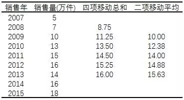
    4、移动平均法**一般只适用于具有直线趋势的时间数列**。
- 2 加权移动平均
  - 简单移动平均法每个观测值都用相同的权数，即假定过去各期的资料对预测期的影响程度相同。但在加权移动平均中，每个观测值被赋予相应的权重。
    例如，在大多数情况下，越近的资料应该有最大的权重，而较远的资料的权重较低。
    还是以上面例题作解，采用三项加权移动平均，最近时期观测值的权数为最远时期观测值的3倍，中间时期观测值的权数为最远时期的2倍，结果如下：
    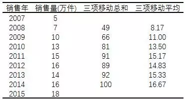
    以第一项为例说明：1/6*5+2/6*7+3/6*10=8.17。
    如果相信较近时期的历史资料比较远的资料对预测未来更合适，则应该给予较近的资料更大的权重。对于波动很大的时间数列，用相等的权重较合适。
- 3 指数平滑
  - 指数平滑法是加权移动平均法的一种特殊情形。只选择一个权数，即最近时期观测值得权数，其它时期数据值的权数可以自动推算出来，观测值离预测时期越远，它的权数就越小。
  - 模型如下：
    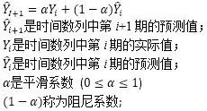
    现在根据包含三个时期资料的时间数列Y1，Y2和Y3，来说明任何时期指数平滑法的预测值，同样也是时间数列以前所有时期实际值的一个加权平均数。
    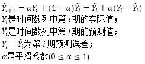
    可以得到一个结论，即**任何预测值都是以前所有时间数列数值的加权平均数**。
    - 平滑常数α
    	- 可以选在0到1之间的任何数，但是有些α值会比其他α值能产生更合适的预测。为观察如何得到一个合适的α值，将基本指数平滑模型改写为：
	      
	      ​以上面例题讲解：
	      
	      如果数据波动较大，α值应取大一些，可以增加近期数据对预测结果的影响。	    
	      如果数据波动平稳，α值应取小一些。	    
	    - 理论界一般认为有以下方法可供选择：
	      - 经验判断法：
	        1、当时间序列呈现较稳定的水平趋势时，应选较小的α值，一般可在0.05~0.20之间取值；
	        2、当时间序列有波动，但长期趋势变化不大时，可选稍大的α值，常在0.1~0.4之间取值；
	        3、当时间序列波动很大，长期趋势变化幅度较大，呈现明显且迅速的上升或下降趋势时，宜选择较大的α值，如可在0.6~0.8间选值，以使预测模型灵敏度高些，能迅速跟上数据的变化；
	        4、当是上升（或下降）的发展趋势类型，α应取较大的值，在0.6~1之间。
	      - 试算法：
	        根据具体时间序列情况，参照经验判断法，来大致确定额定的取值范围，然后取几个α值进行试算，比较不同α值下的预测标准误差，选取预测标准误差最小的α。可以将平滑系数为0.3代入上面例题，比较两者的误差。

###### B 最小二乘法
最小二乘法就是根据数据点确定出趋势方程，这里又可以分为线性趋势分析和非线性趋势分析。
- 线性趋势分析
- 非线性趋势分析
  经济现象的特点不同，发展变化趋势也不同。可能是线性的，也可能是非线性的。在现实生活中，大量经济现象的发展变化趋势曲线形式很多，这里先介绍两种：二次方程曲线和指数曲线。
  - 二次方程曲线
  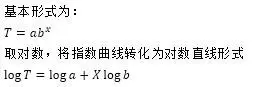
  - 指数曲线
  

###### C 如何选择模型
由于数据特点不同，变动趋势也有差异，分析时应区分情况，选择不同的分析模型，才能更好地放映现象的趋势特征。
- 方法一：通过散点图确定使用哪一种分析模型，这种方法很不精确，有时难以区别趋势类型。
- 方法二：结合时间数列的特征分析，
  - 当所研究现象的一次差（数列逐期增加量或减少量）大致相同，适用直线进行趋势分析；
  - 当所研究现象的二次差（一次差基础上再逐期相减）大致相同，使用二次方程曲线进行分析；
  - 当所研究对象的环比速度大致相同时，则指数曲线较为合适。

#### 2）季节变动 S
季节变动是指由于季节的转变使得指标数值发生周期性变动。由此可见，指标数值的季节变动是以年为周期的，**一般以月、季、周为时间单位，不能以年作单位**，通常用S表示。
引起季节变动的因素有自然因素，也有人为因素。例如，蔬菜食品价格，棉衣销售量都会随着季节气温的变化而周期变化；每年的长假（五一、十一、春节）都会引起出行人数的大量增加。

##### 季节变动分析
季节变动分析是以月或季为单位的时间数列，测定以年为周期随季节转变而发生的有规律的周期变动。为了消除偶然因素影响，一般应使用多年（至少三年）的历史资料。
分析季节变动的方法很多，这里介绍两种：同期平均法和长期趋势剔除法。

######  A 同期平均法
同期平均法计算简单，容易理解，用一张表即可：
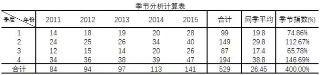
从表中可以清楚知道每个季度的季度指数。但是这种方法计算的结果误差较大，因为**这种方法没有考虑到长期趋势变化的影响**，从上表的合计可以看出，每年数据都在上升，有明显的长期趋势影响。如果只分析季节变化时，应该对长期趋势的影响予以扣除。

###### B 长期趋势剔除法
这种方法是先确定出各期的趋势值，然后再从观测值中扣除趋势值，从而测定季节指数。下面举例说明：
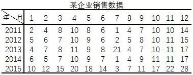
将上面的数据做散点图：
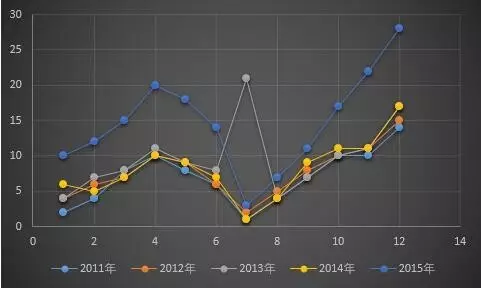
从图上看，虽然每年的数据起伏波动较大，但是这种波动具有明显的规律性，即每年第一季度和第三季度的销售量相对较低，而第二季度和第四季度的销售量相对较高，这说明销售量的变化受季节变动的影响。同时随着时间的推移，销售量又逐年增加，这说明销售量的变化也受长期趋势的影响。因而，为了准确的确定季节指数，就需要剔除长期趋势对销售量的影响，即应该采用长期趋势剔除法。

- 分析步骤如下：
	- 1、对给定的数列先进行四项（以季为单位的资料）或十二项（以月为单位）的移动平均，从而消除不规则变动（I）和季节变动（S）影响，得到趋势分量（T）和循环分量（C）。
		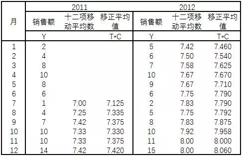	
		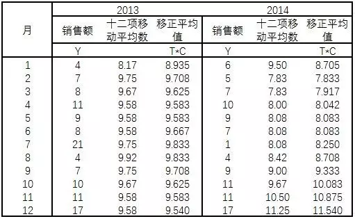
		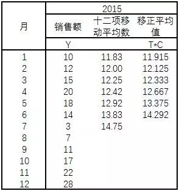	
	- 2、从原数列中扣除长期趋势和循环分量影响，分离出季节分量和不规则分量（S*I）： S*I=Y/T*C
	例如：2011年1月数据，S*I=Y/T*C=1/7.125=14.04%；
	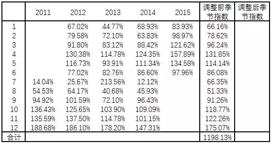
	- 3、从季节分量和不规则分量（S*I）中应用平均法消除由于偶然因素引起的不规则变动的影响，分离出季节指数（S）。
	
	  - 调整前季节指数：
	    每年同一个月的均值，例如2011年1月，(67.02%+44.77%+68.93%+83.93%)/4=66.16%，即将季节分量和不规则分量经过简单平均消除不规则变动的影响后，分离出调整前季节分量。
	  - 调整后季节指数： 调整后季节指数=调整系数*调整前季节指数
	    从理论上说，如果没有季节因素影响，各期季节指数都应该是100%，12个月的季节指数之和应为1200%，实际为1198.13%，所以调整系数为：
	    调整系数=1200%/1198.13%=1.00016；然后用调整系数乘调整前季节指数得到调整后指数，计算结果如下：
	    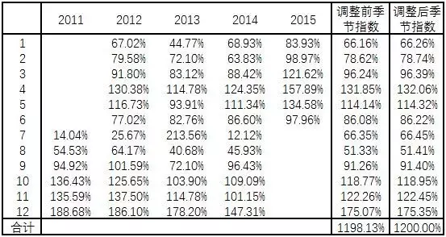

#### 3）周期（循环）变动 C
循环变动与季节变动的周期不同，循环变动通常以若干年为周期，在曲线图上表现为波浪式的周期变动。这种周期变动的特征变现为增加和减少交替出现。最典型的周期案例就是市场经济的商业周期。

##### 循环变动分析
循环变动是指一年以上的周期内，时间数列沿着长期趋势直线上下波动变化。
- A 循环变动分析过程如下：
  - 1、首先将原始数据（按月、季、天等）构成的时间数列，调整为以年为单位的时间数列。
    - 因为在影响时间数列的四种因素中，季节变动是一年内的有规律变化，不影响其它年份，所以**使用以年为周期的时间数列消除了季节变动影响，只反映长期趋势、循环变动和不规则变动的影响**。
  - 2、利用趋势方程确定长期趋势T。
  - 3、不规则变动假定为随机变量，在一段时间上的变化总量趋于0.
  - 4、确定循环变动C。
- B 循环变动可以用趋势百分数表示，公式如下：
  - **趋势百分数(C)=实际观测值(Y)/长期趋势值(T)*100%**
- C 范例分析
  - 某公司近9年的销售情况如下表：
	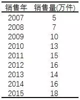
	- 用最小二乘法，计算过程可回顾：长期趋势分析，趋势方程为：T=12.67+1.5X, T为长期趋势值。
	- 可列出循环变动计算表：
	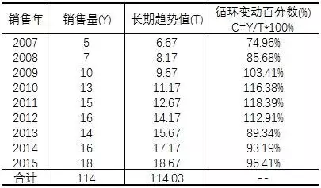
	- 可以看出，实际值围绕长期趋势直线波动幅度在74.96%至118.39%之间。
	- 用循环变动百分数可以描述过去循环变动的变化情况。
	- 但是由于影响循环变动的因素难以预料，所以不能进行未来推断。

#### 4）不规则变动 I
从时间数列中剔除长期趋势、循环变动和季节变动后，还有不可预测的不规则变化因素保留下来。不规则变动的原因有时很明显，有时又难以捕捉，所以不规则变动具有不可预见性，不能用确切的公式加以确定。**由于不规则变动的随机性，在一段时间内这些随机因素可以互相抵消，这样，在对时间数列的变化因素进行分析时，可以不予考虑。**

### 2 两种模型
反映在具体的时间序列图上
- 如果随着时间的推移，**序列的季节波动变得越来越大**，则反映各种变动之间的关系发生变化，建议使用**乘积模型**；
- 反之，如果时间序列图的波动保持恒定，则可以直接使用**叠加模型**。

#### 1）加法模型 Y = T + S + C + I
如果四种变动之间是相互独立的关系。

#### 2）乘法模型 Y = T * S * C * I
如果四种变动之间存在相互影响关系。

# 第二章 时序模型
- 时间序列分析分成两种形式
  - 传统的时间序列分析方法
    - 研究时间序列是否能被分解成上面介绍的四种变动，并解析引起每种变动的影响因素。
  - 时间序列的模型解析法
    - 常用时间序列模型有自回归（AR）模型、滑动平均（MA）模型、自回归滑动平均（ARMA）模型等。
- 两种形式的对比
	- 两者的分析原理是不同
		- 时间序列分解是力求将时间序列分解成不同的变动成分，分析每种变动成分的规律，然后在综合各种成分的规律用于预测；
		- AR/MA/ARMA/ARIMA模型体系是从时间序列数值本身的相关关系出发，将移动平均技术、相关分析技术和平稳技术（差分）等纳入模型，力求建立时间序列数值之间的回归方程，从而达到预测的目的。

因为传统时间序列分析技术（时间序列分解法）的缺陷，所以统计学家开发出更为通用的时间序列分析方法，其中AR/MA/ARMA/ARIMA在这个发展过程中扮演了非常重要的角色，直到现在，它们都在实际工作生活中发挥重要作用。这四种分析方法的共同特点都是跳出变动成分的分析角度，**从时间序列本身出发，力求得出前期数据与后期数据的量化关系，从而建立前期数据为自变量，后期数据为因变量的模型，达到预测的目的**。

## （一）时间序列的平稳性
平稳时间序列和非平稳时间序列，**AR/MA/ARMA用于分析平稳时间序列，ARIMA通过差分可以用于处理非平稳时间序列**。
- 平稳时间序列和非平稳时间序列如下面两幅图所示：
	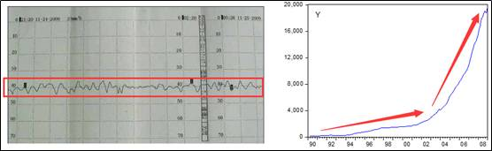
	- 左边的图是工业生产中的温度时间序列，它是围绕一个常数上下波动的，也就是计算时间序列所有数值的平均值，会等于这个常数。工业生产中对液面、压力、温度的控制过程；某地的气温变化过程；某条河流的水位变化过程基本都属于平稳时间序列。
	- 右边的图是中国外汇储备额的时间序列，可以发现这个时间序列是有持续增长的，先慢后快，这是一个非平稳时间序列。在经济领域，例如一个国家的GDP、进出口额的时间序列基本都是非平稳时间序列。

- **一般具有长期趋势的时间序列都是非平稳时间序列。**
	根据趋势的不同，可以使用差分将具有长期趋势的时间序列转换成平稳时间序列。
	例如，线性增长的长期趋势，可以通过一阶差分形成新的平稳的（消除长期趋势）时间序列：
	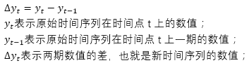
	例如，时间序列的数值为线性增长的(1,2,3,4,5,6,7,8)，经过一阶差分以后，新的时间序列的数值为(1,1,1,1,1,1,1)，就成为稳定的时间序列了。

- 根据长期趋势的发展趋势不同，可以进行差分的次数和方法也不相同，一般的规律如下：
	- 一次差分的时间序列数值大体相同，配合直线趋势；
	- 二次差分的时间序列数值大体相同，配合二次曲线
	- 对数的一次差分的时间序列数值大体相同，配合指数曲线
	- 一次差分的环比值大体相同，配合修正指数曲线
	- 对数一次差分的环比值大体相同，配合Gompertz曲线
	- 倒数一次差分的环比值大体相同，配合Logistic曲线

- 四种模型
	- AR模型称为自回归模型（Auto Regressive model）；
	- MA模型称为移动平均模型（Moving Average model）；
	- ARMA称为自回归移动平均模型（Auto Regressive and Moving Average model）；
	- ARIMA模型称为差分自回归移动平均模型。

## （二）AR模型
如果某个时间序列的任意数值可以表示成下面的回归方程，那么该时间序列服从p阶的自回归过程，可以表示为AR(p)：
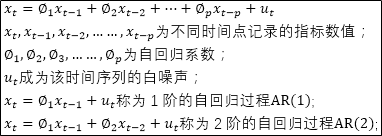
可以发现，AR模型利用前期数值与后期数值的相关关系（自相关），建立包含前期数值和后期数值的回归方程，达到预测的目的，因此成为自回归过程。

这里需要解释白噪声，大家可以将白噪声理解成时间序列数值的随机波动，这些随机波动的总和会等于0，例如某条饼干的自动化生产线，要求每包饼干为500克，但是生产出来的饼干产品由于随机因素的影响，不可能精确的等于500克，而是会在500克上下波动，这些波动的总和将会等于互相抵消等于0。

## （三）MA模型
如果某个时间序列的任意数值可以表示成下面的回归方程，那么该时间序列服从q阶的移动平均过程，可以表示为MA(q)：

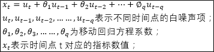

可以发现，某个时间点的指标数值等于白噪声序列的加权和，如果回归方程中，白噪声只有两项，那么该移动平均过程为2阶移动平均过程MA(2)。比较自回归过程和移动平均过程可知，移动平均过程其实可以作为自回归过程的补充，解决自回归方差中白噪声的求解问题，两者的组合就成为自回归移动平均过程，称为ARMA模型。

## （四）ARMA模型
自回归移动平均模型由两部分组成：自回归部分和移动平均部分，因此包含两个阶数，可以表示为ARMA(p,q)，p是自回归阶数，q为移动平均阶数，回归方程表示为：

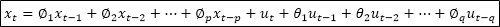

从回归方程可知，自回归移动平均模型综合了AR和MA两个模型的优势，在ARMA模型中，自回归过程负责量化当前数据与前期数据之间的关系，移动平均过程负责解决随机变动项的求解问题，因此，该模型更为有效和常用。

## （五）ARIMA模型
介绍时间序列平稳性时提到过，AR/MA/ARMA模型适用于平稳时间序列的分析，当时间序列存在上升或下降趋势时，这些模型的分析效果就大打折扣了，这时差分自回归移动平均模型也就应运而生。ARIMA模型能够用于齐次非平稳时间序列的分析，这里的齐次指的是原本不平稳的时间序列经过d次差分后成为平稳时间序列。

在现实生活中，存在很多非平稳的时间序列，它们的均值和方差是随着时间的变化而变化的，幸运的是，统计学家们发现，很多时间序列本身虽然不平稳，但是经过差分（相邻时间点的指标数值相减）之后，形成的新时间序列就变成平稳时间序列了。因此，差分自回归移动平均模型写成ARIMA(p,d,q)。p代表自回归阶数；d代表差分次数；q代表移动平均阶数。在spss软件中，有时输出的ARIMA模型包括6个参数：ARIMA(p,d,q)(P,D,Q)，这是因为如果时间序列中包含季节变动成分的话，需要首先将季节变动分解出来，然后再分别分析移除季节变动后的时间序列和季节变动本身。这里小写的p,d,q描述的是移除季节变动成分后的时间序列；大写的P,D,Q描述的是季节变动成分。两个部分是相乘的关系。因此，ARIMA(p,d,q)(P,D,Q)也被称为复合季节模型。

# 第三章 应用操作

